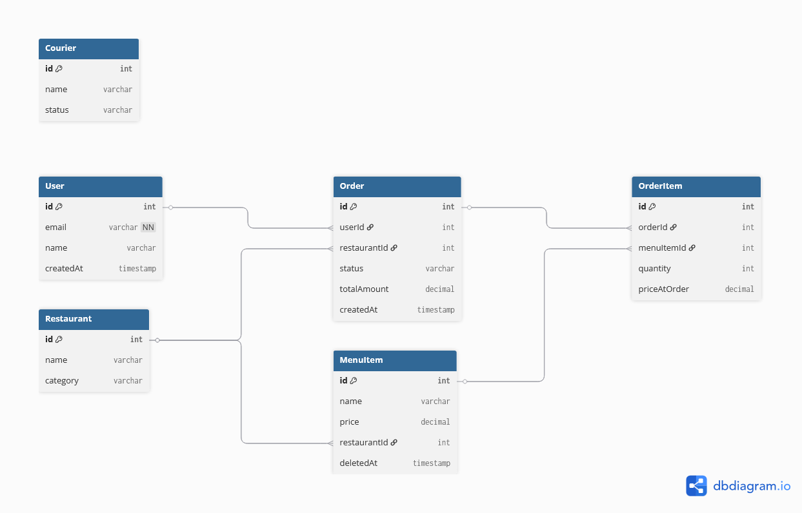

# Схема бази даних

База даних спроєктована в 3-й нормальній формі (3NF).

## Таблиці

### 1. User
Зберігає інформацію про клієнтів.
- **id**: Унікальний ідентифікатор.
- **email**: Пошта (унікальна).
- **name**: Ім'я користувача.

### 2. Restaurant
Заклади харчування.
- **items**: Зв'язок "один-до-багатьох" зі стравами.

### 3. MenuItem
Страви конкретного ресторану.
- **deletedAt**: Використовується для Soft Delete.
- **restaurantId**: Зовнішній ключ до ресторану.

### 4. Order
Замовлення.
- **status**: Статус (PENDING, DONE).
- **totalAmount**: Загальна сума (фіксується в момент замовлення).

### 5. OrderItem
Проміжна таблиця для зв'язку Many-to-Many між Замовленням та Стравами.
- **priceAtOrder**: Ціна страви на момент покупки (важливо для історії, якщо ціна зміниться).

## ER Diagram
