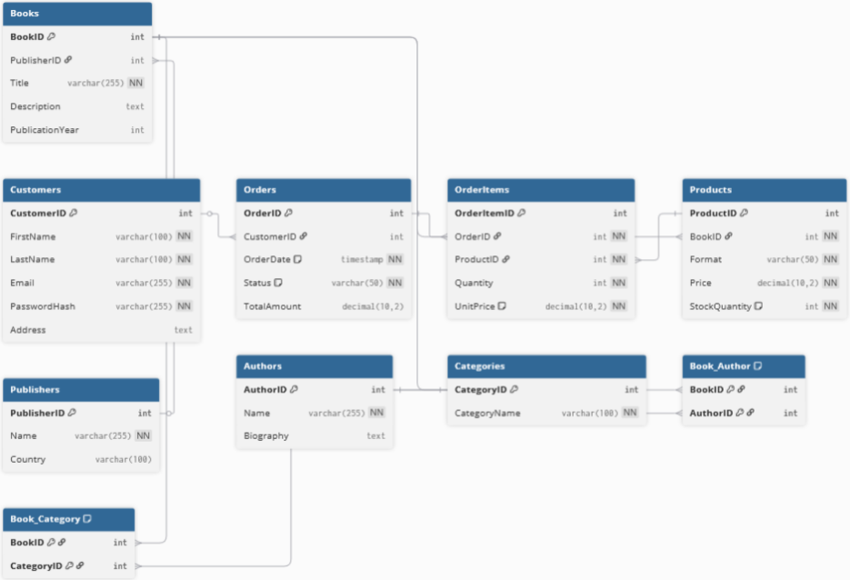

# Lab 1
## Короткий виклад вимог:
* Система повинна керувати складним каталогом (книги, автори, видавництва), обробляти замовлення клієнтів, відстежувати складські залишки та дозволяти
категоризувати товари.
### Ключові елементи даних для зберігання:
* Клієнти: Реєстраційна інформація (ім'я, email, хеш пароля, адреса доставки).
* Автори: Інформація про авторів (ім'я, біографія).
* Видавництва: Інформація про видавництва (назва, країна).
* Книги: Інформація про "твір" (назва, опис, рік першої публікації).
* Товари: Конкретні екземпляри книг, що продаються.
* Категорії: Жанри для класифікації книг.
* Замовлення: Інформація про покупки (хто замовив, дата, статус).
* Позиції замовлення: Деталізація того, які товари та в якій кількості увійшли до кожного
замовлення.

## Бізнес-правила:
* Одна книга може мати багатьох авторів.
* Один автор може написати багато книг. (Зв'язок "багато-до-багатьох").
* Одна книга може належати до багатьох категорій.
* Одна категорія може включати багато книг. (Зв'язок "багато-до-багатьох").
* Одна книга публікується одним видавництвом.
* Один клієнт може зробити багато замовлень.
* Одне замовлення може містити багато різних товарів.

## ERD діаграма:

## Список сутностей:
### Customer (Клієнт)
* CustomerID (PK): Унікальний ID клієнта.
* FirstName: Ім'я.
* LastName: Прізвище.
* Email: Електронна пошта (унікальний).
* PasswordHash: Хеш пароля.
* Address: Адреса доставки.
### Book (Книга - твір)
* BookID (PK): Унікальний ID твору.
* PublisherID (FK): ID видавця.
* Title: Назва.
* Description: Опис.
* PublicationYear: Рік першої публікації.
### Author (Автор)
* AuthorID (PK): Унікальний ID автора.
* Name: Ім'я автора.
* Biography: Біографія.
### Publisher (Видавництво)
* PublisherID (PK): Унікальний ID видавництва.
* Name: Назва.
* Country: Країна.
### Product (Товар - конкретний формат книги)
* ProductID (PK): Унікальний ID товару/SKU.
* BookID (FK): ID твору, до якого відноситься товар.
* Format: Формат.
* Price: Ціна.
* StockQuantity: Кількість на складі.
### Category (Категорія)
* CategoryID (PK): Унікальний ID категорії.
* CategoryName: Назва категорії.
### Order (Замовлення)
* OrderID (PK): Унікальний ID замовлення.
* CustomerID (FK): ID клієнта, що зробив замовлення.
* OrderDate: Дата замовлення.
* Status: Статус (н-д, "Обробка", "Відправлено").
* TotalAmount: Загальна сума (можна обчислювати).
### OrderItem (Позиція замовлення - асоціативна)
* OrderItemID (PK): Унікальний ID позиції.
* OrderID (FK): ID замовлення.
* ProductID (FK): ID купленого товару.
* Quantity: Кількість.
* UnitPrice: Ціна за одиницю (фіксується на момент покупки).
### Book_Author (Автори книги - асоціативна)
* BookID (FK): ID книги.
* AuthorID (FK): ID автора.
### Book_Category (Категорії книги - асоціативна)
* BookID (FK): ID книги.
* CategoryID (FK): ID категорії.

## Пояснення зв'язків:
* Customer ↔ Order (Один-до-багатьох) Один клієнт може зробити багато замовлень,
але кожне замовлення належить лише одному клієнту.
* Order ↔ OrderItem (Один-до-багатьох) Одне замовлення може складатися з багатьох
позицій, але кожна позиція належить лише одному замовленню.
* Product ↔ OrderItem (Один-до-багатьох) Один товар може фігурувати у багатьох
позиціях замовлень, але кожна позиція в замовленні посилається лише на один
конкретний товар.
* Publisher ↔ Book (Один-до-багатьох) Одне видавництво може випустити багато книг,
але у кожної книги є лише одне основне видавництво.
* Book ↔ Product (Один-до-багатьох) Одна книга може мати багато товарів (м'яка
обкладинка, тверда), але кожен товар — це формат лише однієї конкретної книги.
* Book ↔ Author (Багато-до-багатьох) В однієї книги може бути багато авторів, і один
автор може написати багато книг. Цей зв'язок реалізується через проміжну таблицю
Book_Author.
* Book ↔ Category (Багато-до-багатьох) Прозою: Одна книга може входити до багатьох
категорій (н-д, "Фантастика" та "Бестселер"), і одна категорія містить багато книг. Цей
зв'язок реалізується через проміжну таблицю Book_Category.

## Припущення чи обмеження:
* Зберігання паролів: У таблиці Customer зберігається не сам пароль, а PasswordHash.
* Облік залишків: Складський облік (StockQuantity) ведеться на рівні Product
(конкретного формату), а не на рівні Book (твору).
* Ціна на момент покупки: Таблиця OrderItem зберігає UnitPrice — копію ціни з
таблиці Product на момент здійснення замовлення.
* Спрощення замовлення: Адреса доставки зберігається у профілі клієнта, а не в самому
замовленні.
* Складені ключі: У сполучних таблицях Book_Author та Book_Category як первинний
ключ використовується комбінація (пара) зовнішніх ключів, що гарантує унікальність
зв'язків.
