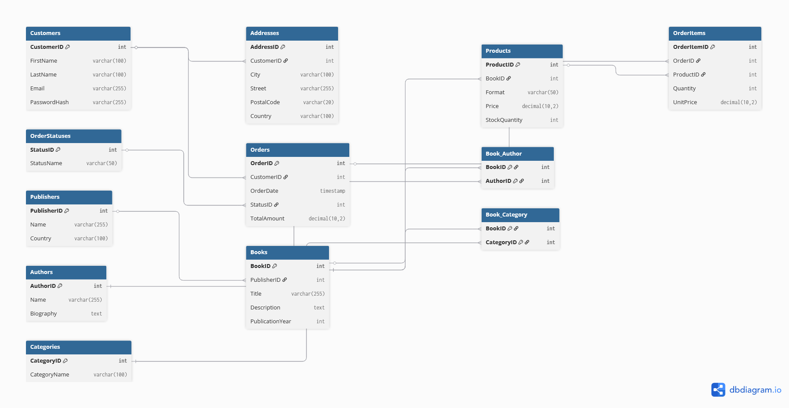

# Lab 5
## Оновлена ER діаграма

## Alter Table для Orders
```
-- Додавання нового стовпця
ALTER TABLE Orders ADD COLUMN StatusID INT;

-- Налаштування зв'язку(FK)
ALTER TABLE Orders 
    ALTER COLUMN StatusID SET NOT NULL,
    ADD FOREIGN KEY (StatusID) REFERENCES OrderStatuses(StatusID);

-- Видалення старого стовпця
ALTER TABLE Orders DROP COLUMN Status;
```
## Alter Table для Customers
-- Видалення старого стовпця
```
ALTER TABLE Customers DROP COLUMN Address;
```
## Функціональні залежності
1. Customers(До нормалізації)

* CustomerID -> FirstName, LastName, Email, PasswordHash, Address

2. Addresses(3НФ)

* AddressID -> CustomerID, City, Street, PostalCode, Country

3. Orders(До нормалізації)

* OrderID -> CustomerID, OrderDate, TotalAmount, Status (текст)

4. Orders(3НФ)

* OrderID -> CustomerID, OrderDate, TotalAmount, StatusID

5. OrderStatuses (3НФ)

* StatusID -> StatusName

6. Інші таблиці(Без змін)

* Books: BookID -> Title, Description, PublicationYear, PublisherID

* Products: ProductID -> BookID, Format, Price, StockQuantity

* Authors: AuthorID -> Name, Biography

* Publishers: PublisherID -> Name, Country

* Categories: CategoryID -> CategoryName
## Покрокове пояснення нормалізації
1. Таблиця Customers (Проблема 1НФ)

Проблема: У таблиці Customers поле Address містило значення: "м. Київ, вул. Хрещатик, 1". Це порушує 1НФ, яка вимагає атомарності атрибутів. Адреса - складене значення, яке не можна ефективно фільтрувати. Також, якщо клієнт має дві адреси, нам довелося б дублювати рядок клієнта, що створює надлишковість.

Перехід до 1НФ: Щоб задовольнити 1НФ, ми повинні розбити адресу на найменші значущі частини: City, Street, PostalCode.

Перехід до 2НФ та 3НФ: Оскільки один клієнт може мати кілька адрес (один-до-багатьох), зберігання цих атомарних колонок прямо в таблиці Customers призвело б до дублювання даних самого клієнта. Тому найкращим рішенням для нормалізації є винесення адрес в окрему таблицю Addresses.

* Рішення: Створено таблицю Addresses.

* Результат: Таблиця Customers тепер містить лише дані про особу. Адреси розділені на атомарні частини і знаходяться в окремій таблиці. Схема відповідає 3НФ.

2. Аналіз таблиці Orders (Проблема 3НФ)

Проблема: У таблиці Orders поле Status містило текстові значення: "Обробка", "Відправлено". Це не порушує 1НФ і не порушує 2НФ. Однак, це порушує 3НФ. Текстовий опис статусу залежить не тільки від конкретного замовлення, а від сутності "Статус" загалом. Якщо ми захочемо змінити назву статусу "Обробка" на "Комплектація", нам доведеться оновлювати тисячі рядків таблиці Orders, що є аномалією оновлення.

Перехід від 2НФ до 3НФ: Щоб усунути цю проблему, потрібно винести список можливих статусів в окрему таблицю.

* Ми ідентифікуємо залежність: Status Name дублюється.

* Створюємо таблицю OrderStatuses (StatusID, StatusName).

* У таблиці Orders замінюємо текст Status на зовнішній ключ StatusID.

* Рішення: Створено таблицю OrderStatuses.

* Результат: Таблиця Orders залежить лише від свого первинного ключа. Назва статусу зберігається в одному місці.
## Усі зміни у БД
```
CREATE TABLE OrderStatuses (
    StatusID SERIAL PRIMARY KEY,
    StatusName VARCHAR(50) NOT NULL UNIQUE
);

INSERT INTO OrderStatuses (StatusName)
SELECT DISTINCT Status FROM Orders;

ALTER TABLE Orders ADD COLUMN StatusID INT;

UPDATE Orders o
SET StatusID = os.StatusID
FROM OrderStatuses os
WHERE o.Status = os.StatusName;

ALTER TABLE Orders 
    ALTER COLUMN StatusID SET NOT NULL,
    ADD FOREIGN KEY (StatusID) REFERENCES OrderStatuses(StatusID);

ALTER TABLE Orders DROP COLUMN Status;


CREATE TABLE Addresses (
    AddressID SERIAL PRIMARY KEY,
    CustomerID INT NOT NULL,
    City VARCHAR(100),
    Street VARCHAR(255),
    PostalCode VARCHAR(20),
    Country VARCHAR(100) DEFAULT 'Україна',
    FOREIGN KEY (CustomerID) REFERENCES Customers(CustomerID) ON DELETE CASCADE
);

INSERT INTO Addresses (CustomerID, Street, City)
SELECT CustomerID, Address, 'Не вказано'
FROM Customers
WHERE Address IS NOT NULL;

ALTER TABLE Customers DROP COLUMN Address;

UPDATE Addresses SET City = 'Київ' WHERE Street LIKE '%Київ%';
UPDATE Addresses SET City = 'Львів' WHERE Street LIKE '%Львів%';
UPDATE Addresses SET City = 'Одеса' WHERE Street LIKE '%Одеса%';
UPDATE Addresses SET City = 'Харків' WHERE Street LIKE '%Харків%';
```