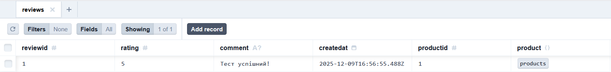
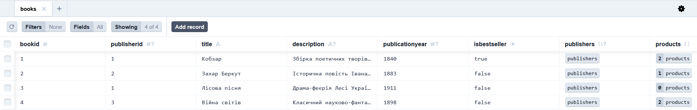

# Lab 6
## Міграція 1: Додавання таблиці відгуків (Reviews)

**Опис зміни:**
Додано нову сутність reviews для зберігання відгуків. Налаштовано зв'язок між товарами та відгуками.

### До:
* У моделі products не було жодної згадки про відгуки, а моделі reviews не існувало взагалі.
```
model products {
  productid     Int          @id @default(autoincrement())
  bookid        Int
  format        String       @db.VarChar(50)
  price         Decimal      @db.Decimal(10, 2)
  stockquantity Int          @default(0)
  
  books         books        @relation(fields: [bookid], references: [bookid], onDelete: Cascade, onUpdate: NoAction)
  orderitems    orderitems[]
}
```
### Після:
* Створено нову модель reviews і додано поле reviews[] у модель products.
```
model reviews {
  reviewid  Int      @id @default(autoincrement())
  rating    Int
  comment   String?
  createdat DateTime @default(now())
  productid Int
  
  product   products @relation(fields: [productid], references: [productid])
}

model products {
  productid     Int          @id @default(autoincrement())
  bookid        Int
  format        String       @db.VarChar(50)
  price         Decimal      @db.Decimal(10, 2)
  stockquantity Int          @default(0)
  
  books         books        @relation(fields: [bookid], references: [bookid], onDelete: Cascade, onUpdate: NoAction)
  orderitems    orderitems[]
  reviews       reviews[]
}
```
## Міграція 2: Додавання поля IsBestSeller
### До:
* Модель books містила лише стандартні поля.
```
model books {
  bookid          Int           @id @default(autoincrement())
  publisherid     Int?
  title           String        @db.VarChar(255)
  description     String?
  publicationyear Int?
  
  publishers      publishers?   @relation(fields: [publisherid], references: [publisherid], onDelete: NoAction, onUpdate: NoAction)
  products        products[]
  book_author     book_author[]
  book_category   book_category[]
}
```
### Після:
* Додано поле isbestseller зі значенням за замовчуванням false.
```
model books {
  bookid          Int           @id @default(autoincrement())
  publisherid     Int?
  title           String        @db.VarChar(255)
  description     String?
  publicationyear Int?
  isbestseller    Boolean       @default(false)
  
  publishers      publishers?   @relation(fields: [publisherid], references: [publisherid], onDelete: NoAction, onUpdate: NoAction)
  products        products[]
  book_author     book_author[]
  book_category   book_category[]
}
```
## Міграція 3: Видалення стовпця Description
### До:
* Поле description було присутнє.
```
model books {
  bookid          Int           @id @default(autoincrement())
  publisherid     Int?
  title           String        @db.VarChar(255)
  description     String?
  publicationyear Int?
  isbestseller    Boolean       @default(false)
  
  publishers      publishers?   @relation(...)
  products        products[]
}
```
### Після:
* Поле description повністю відсутнє.
```
model books {
  bookid          Int           @id @default(autoincrement())
  publisherid     Int?
  title           String        @db.VarChar(255)
  publicationyear Int?
  isbestseller    Boolean       @default(false)
  
  publishers      publishers?   @relation(...)
  products        products[]
}
```
## Скриншоти що підтверджують результат


